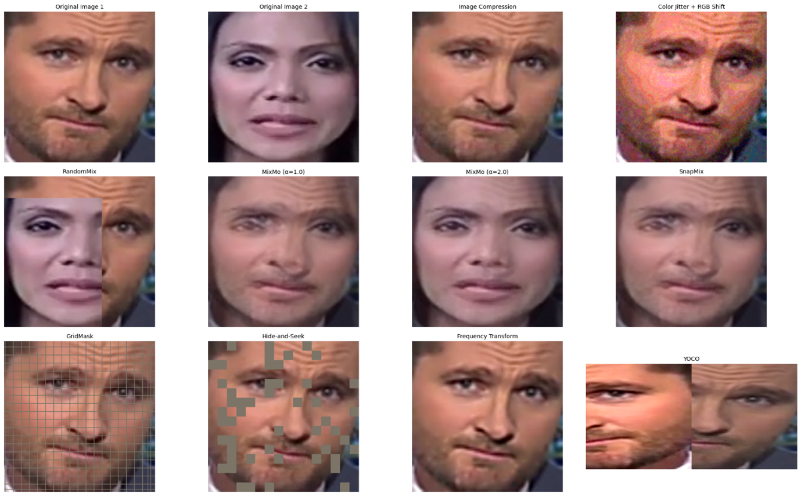
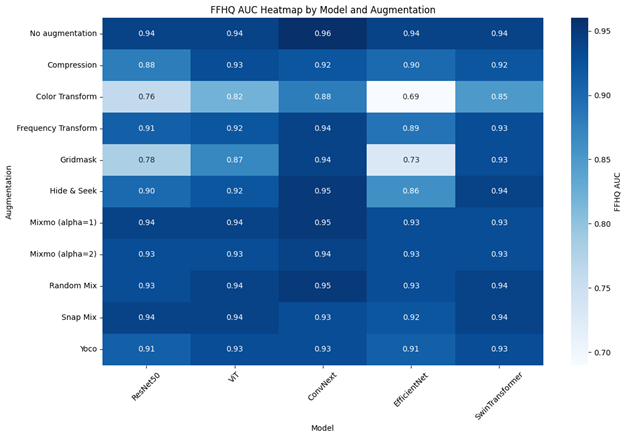
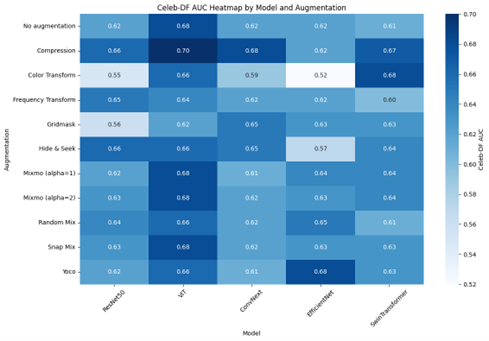
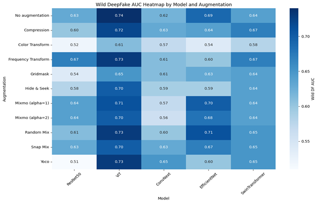
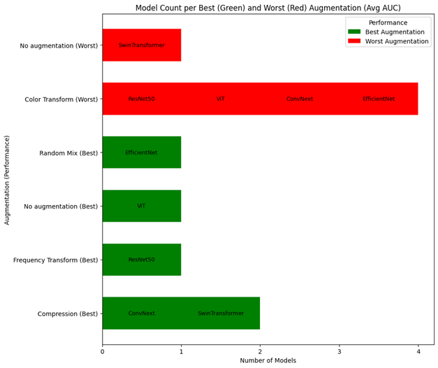
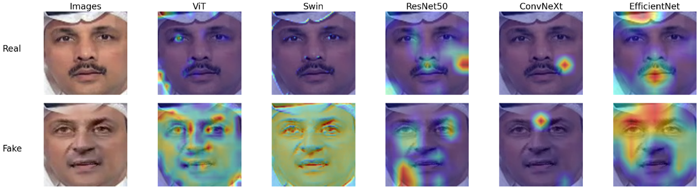

#  Improving Deepfake Model Generalization with Augmentations, Perturbations, and Loss Function Analysis

This project explores how various **image augmentations**, **perturbations**, and training strategies impact the **generalization performance** of deepfake detection models across different datasets.

We use 5 popular **baseline architectures** — including both **CNNs** and **Transformers** — trained on the **FF++ (HQ)** dataset. No architectural modifications are made to the models themselves; instead, we analyze how different data-level interventions affect performance.

Models are evaluated on **CelebDF-v2** and **WildDeepfake**, which represent challenging cross-domain testing conditions.

In addition to classification metrics like **AUC**, **Accuracy**, and **EER**, we use **Grad-CAM visualizations** to understand how attention maps shift depending on augmentation strategy.

---

##  Project Pipeline Overview

The following diagram illustrates the complete deepfake detection pipeline — from input preprocessing and augmentation to model inference and evaluation:

**Figure:** *Pipeline stages include:*
- Batch of input face images
- Resizing and normalization
- Application of a selected augmentation strategy
- Feature extraction using one of the baseline models
- Prediction (Real/Fake)
- Evaluation via AUC, ROC curves, confusion matrices, and training curves

---

##  Repository Structure

The repository is organized by model architecture. Each folder contains Jupyter notebooks for training and evaluating deepfake detection models with different augmentation strategies.

Dissertation-deepfake-image-detection/

│
├── ResNet50/

├── ConvNeXt/

├── Vision Transformer (ViT)/

├── EfficientNet/

├── Swin Transformer/

├── Figures/

└── README.md

Each model folder includes multiple `.ipynb` files — one for each augmentation strategy (e.g., Compression, MixMo, Frequency Transform, etc.).

---

---

##  Augmentations Used

This project evaluates the impact of the following **11 image augmentations**, grouped by the type of transformation they apply to the training data:

| Category               | Techniques                                                  |
|------------------------|-------------------------------------------------------------|
| Baseline               | No Augmentation                                             |
| Compression-Based      | JPEG Compression                                            |
| Color-Based            | Color Transform                                             |
| Frequency-Based        | Frequency Transform                                         |
| Occlusion-Based        | Hide & Seek                                                 |
| Patch-Based            | Gridmask, Random Mix                                        |
| Mix-Based              | SnapMix, MixMo (α=1), MixMo (α=2)                           |
| Spatial-Based          | YoCo (You Only Cut Once)                                    |

> Each augmentation was applied independently to evaluate its impact on model accuracy, robustness, and generalization across datasets.

### Augmentation Visuals

The figure below illustrates how different augmentation strategies modify the input face images:

---

##  Models Used

The project evaluates five baseline models representing both CNN and Transformer-based architectures. Each model was pretrained on ImageNet and fine-tuned on the FFHQ dataset using different augmentations.

| Model                 | Type           | Key Features                                         | Total Parameters | Trainable Parameters |
|-----------------------|----------------|------------------------------------------------------|------------------|-----------------------|
| ResNet-50             | CNN            | Residual connections, deep hierarchical features     | 23,512,130       | 4,098                 |
| ConvNeXt V2-Base      | Modern CNN     | ConvNeXt blocks, depthwise convolutions              | 87,692,802       | 2,050                 |
| Vision Transformer    | Transformer    | Patch embedding, self-attention                      | 85,800,194       | 1,538                 |
| EfficientNet-B0       | Scalable CNN   | Compound scaling (depth, width, resolution)          | 4,010,110        | 2,562                 |
| Swin Transformer V2   | Transformer    | Shifted window attention, hierarchical design        | 86,907,898       | 2,050                 |

> All models use **frozen backbones** with **binary trainable heads** to isolate the effect of augmentations during fine-tuning.

---

##  Datasets Used

The following datasets were used to train and evaluate the deepfake detection models. All datasets maintain a **1:1 ratio of real and fake images** for balanced training and testing.

| Dataset         | Training Images | Validation Images | Testing Images | Total Images | Real:Fake Ratio |
|------------------|------------------|--------------------|----------------|---------------|------------------|
| FFHQ             | 171,712          | 33,472             | 33,312         | 238,496       | 1:1              |
| CelebDF-V2       | –                | –                  | 15,232         | 15,232        | 1:1              |
| WildDeepfake     | –                | –                  | 71,840         | 71,840        | 1:1              |

>  **FFHQ** was used for training, validation, and in-domain testing.  
>  **CelebDF-V2** and **WildDeepfake** were used exclusively for **cross-domain testing**.

---

##  Training Configuration

All models were trained using the same configuration to ensure fair comparison across augmentations and architectures:

| Component             | Configuration Details                                 |
|------------------------|------------------------------------------------------|
| Dataset Split          | FFHQ: 80% training, 10% validation, 10% testing      |
| Optimizer              | Adam                                                 |
| Initial Learning Rate  | 0.0001                                               |
| Scheduler              | Gamma decay = 0.1 every 5 epochs                     |
| Loss Function          | Cross-Entropy Loss                                   |
| Early Stopping         | Patience = 5 (based on validation loss)              |
| Batch Size             | 32                                                   |
| Epochs                 | 100                                                  |
| Logging                | TensorBoard (`SummaryWriter`)                        |
| Model Saving           | `torch.save()` — best model based on val accuracy    |
| Evaluation Metrics     | Accuracy, ROC AUC, EER, F1 Score, Confusion Matrix   |
| Interpretability       | Grad-CAM (`pytorch-grad-cam`)                        |
| Test Datasets          | CelebDF-V2, WildDeepfake (cross-dataset evaluation)  |

> Each model uses a **frozen backbone** and **trainable head** to evaluate augmentation effects without retraining full networks.

---

##  Evaluation Metrics

The following metrics were used to evaluate model performance across both in-domain (FFHQ) and cross-domain (CelebDF-V2, WildDeepfake) datasets:

- **Accuracy** – Overall correct predictions (real/fake)
- **ROC AUC (Area Under Curve)** – Measures discrimination threshold
- **EER (Equal Error Rate)** – Point where false acceptance = false rejection
- **F1 Score** – Harmonic mean of precision and recall
- **Confusion Matrix** – Detailed class-wise performance breakdown
- **Grad-CAM Visualizations** – Model interpretability via activation maps

>  All metrics were calculated for each augmentation-model combination to assess both accuracy and generalization performance.

---

##  Results & Visualizations

This section summarizes key outcomes across datasets and models using AUC scores, Grad-CAM visualizations, and confusion matrices.

> All experiments were performed using a frozen backbone and binary trainable head setup, with one augmentation applied per training run.

---

###  AUC Scores on FFHQ (In-Domain)

The heatmap below shows how different augmentations affect model AUC when evaluated on the FFHQ test set:

>  Augmentations like `No-Augmentation`, `Mixmo(alpha=1)`, and `RandomMix` consistently perform well in-domain.

---

###  AUC Scores on CelebDF-V2 & WildDeepfake (Cross-Domain)

These heatmaps visualize model generalization when tested on unseen datasets:

>  Compression-based augmentations improved generalization across all models, especially Vision Transformer.

---

###  Best vs. Worst Augmentation Samples

Below are examples of input images and predictions for the **best** and **worst** performing augmentations:

>  The best augmentation (`Compression` ) improves localization of artifacts.  
>  The worst (e.g., `Color Transform`) fails to guide model attention effectively.

---

###  Grad-CAM Visualizations

Grad-CAM highlights areas the models attend to when classifying deepfakes.

>  Vision Transformer and MobileNet show more distributed attention than CNNs, focusing on manipulation-prone regions (e.g., eyes, mouth).

---

###  Grad-CAM Comparison Across Models

This visualization compares how different models attend to manipulated regions in deepfake images.

)

>  **CNNs** like ResNet50 and EfficientNet focus more on local texture and edges.  
>  **Transformers** like ViT and Swin Transformer show broader and more distributed attention across facial regions.  
>  This highlights differences in spatial bias and generalization strategies between architectures.

