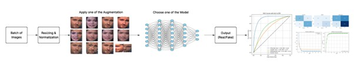

#  Improving Deepfake Model Generalization with Augmentations, Perturbations, and Loss Function Analysis

This project explores how various **image augmentations**, **perturbations**, and training strategies impact the **generalization performance** of deepfake detection models across different datasets.

We use 5 popular **baseline architectures** — including both **CNNs** and **Transformers** — trained on the **FF++ (HQ)** dataset. No architectural modifications are made to the models themselves; instead, we analyze how different data-level interventions affect performance.

Models are evaluated on **CelebDF-v2** and **WildDeepfake**, which represent challenging cross-domain testing conditions.

In addition to classification metrics like **AUC**, **Accuracy**, and **EER**, we use **Grad-CAM visualizations** to understand how attention maps shift depending on augmentation strategy.

---

##  Project Pipeline Overview

The following diagram illustrates the complete deepfake detection pipeline — from input preprocessing and augmentation to model inference and evaluation:

**Figure:** *Pipeline stages include:*
- Batch of input face images
- Resizing and normalization
- Application of a selected augmentation strategy
- Feature extraction using one of the baseline models
- Prediction (Real/Fake)
- Evaluation via AUC, ROC curves, confusion matrices, and training curves

---

##  Repository Structure

The repository is organized by model architecture. Each folder contains Jupyter notebooks for training and evaluating deepfake detection models with different augmentation strategies.

Dissertation-deepfake-image-detection/
│
├── ResNet50/
├── ConvNeXt/
├── Vision Transformer (ViT)/
├── EfficientNet/
├── Swin Transformer/
├── Figures/
└── README.md

Each model folder includes multiple `.ipynb` files — one for each augmentation strategy (e.g., Compression, MixMo, Frequency Transform, etc.).

---

